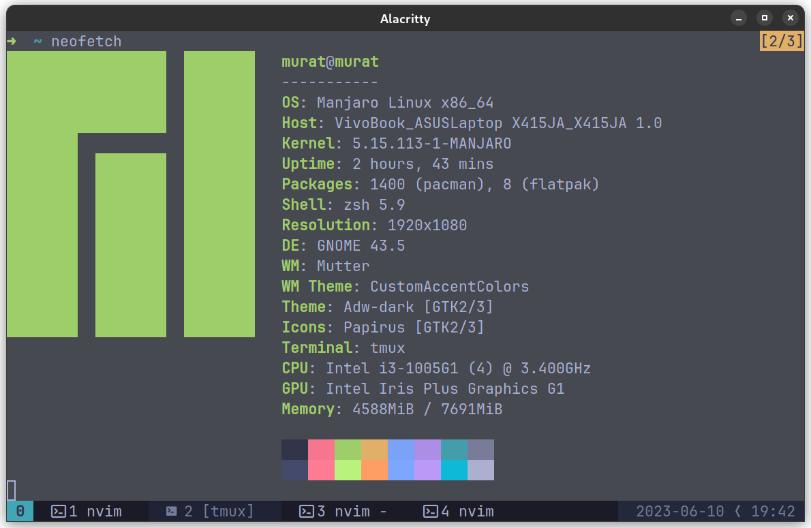

# Dotfiles

script to for my configuration of tmux, neovim, and alacritty terminal




# Installation

to install, run the scirpt:
```
./setup.sh
```

dependencies: `zsh tmux neovim curl git alacritty`

